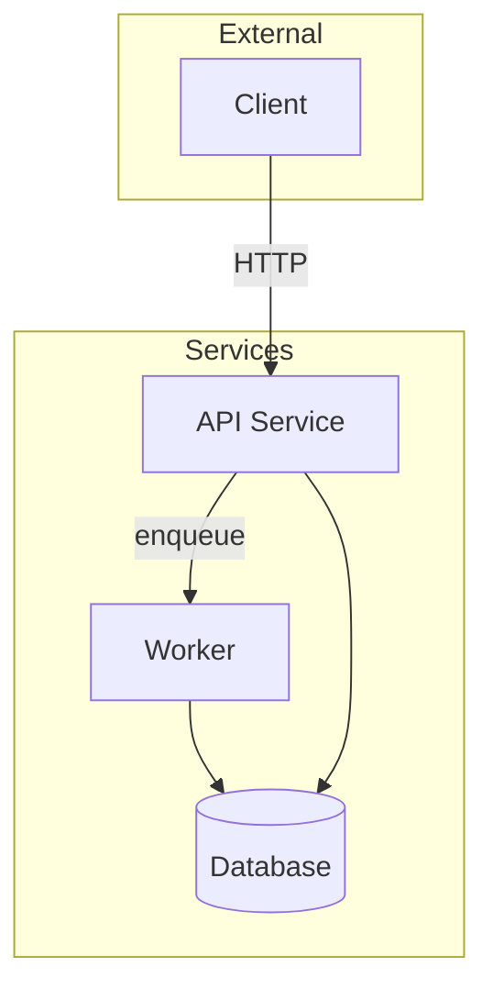

<!--
INSTANTIATION NOTE — read before copying this template.
- `<x>` (plain) is a placeholder — substitute when copying.
- `[[<x>]]` is a placeholder INSIDE a wiki-link — substitute the inner text AND keep the [[ ]] brackets, or delete the line entirely.
- An unsubstituted `[[<x>]]` becomes a broken Obsidian link. See [[CLAUDE]] §11.
- Markers `<!-- SURVEYOR-OWNED START/END -->` and `<!-- WRAP-WORK-OWNED START/END -->` are MANDATORY — see [[meta/project-overview-system]] §3.
- Remove this comment block when instantiating.
-->

# <project>

> Tier-3 high-level architecture。项目入口页：先读下方 Architecture mermaid + Modules/Services list，逐层 click 下钻到 Tier-2（`features/` / `services/` / `modules/` / `api/`）再到 Tier-1（`tasks/YYYY/Mmm/`）。**SURVEYOR 块**由 `/project-decompose` refresh；**WRAP-WORK 块**由 `/wrap-work` 累积。详见 [[meta/project-overview-system]]。

<!-- SURVEYOR-OWNED START last-surveyed:YYYY-MM-DD -->

## Mission 项目目标

_1-3 句话：解决什么问题、给谁用、关键交付物是什么。每次 `/project-survey` 时全量重写。_

## Architecture 架构

**必含**。Mermaid graph 展示模块、服务、上下游、部署关系。

_必要时配 sequenceDiagram / deployment diagram。_

## Modules / Services list

每个 Tier-2 一行，链到对应文件：

- [[<feature-1>]] — _一句话描述_
- [[<service-1>]] — _一句话描述_
- [[<module-1>]] — _一句话描述_
- [[<api-1>]] — _一句话描述_

## Integrations 集成

- 上游：_数据源 / 触发系统_
- 下游：_消费方 / 通知系统_
- 第三方 API / SDK：_列出_

## Tech Stack 技术栈

- Language / Framework: ...
- Storage: ...
- Messaging / Queue: ...
- Observability: ...

<!-- SURVEYOR-OWNED END -->

<!-- WRAP-WORK-OWNED START -->

## Active Work 在进行的工作

- [[<feature>]] — current focus
- 链到最新的几个 task（可选）

## Repo / Code Layout 代码组织（手维护）

- `<repo>` — 主仓库 URL（不含 secrets）
- 主要目录布局简述

## People / Owners 人员（手维护）

- Tech lead: ...
- Team: ...

## Related

- 公司视图: [[<company>]]
- Cross-project decisions: [[experience/decisions/...]]
- 相关 knowledge: [[<concept>]]

## Changelog

- YYYY-MM-DD: snapshot before architecture refresh → [[superseded-<project>-YYYY-MM-DD-HHMM]]
- YYYY-MM-DD: initial version

<!-- WRAP-WORK-OWNED END -->
