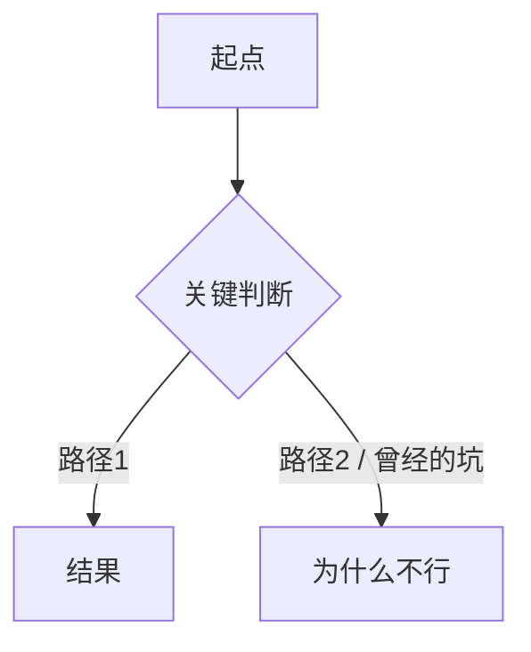

<!--
INSTANTIATION NOTE — read before copying.
1. `<x>` 和 `[[<x>]]` 是占位符 — 复制时替换。未替换的 `[[<x>]]` 会变成 broken link。见 [[CLAUDE]] §11。
2. 本模板遵循 [[memory-summary-spec]]：只记「图 + 逻辑 + 问题/方案 + 决策 + 回忆钩子」。
   禁止 Commit Timeline / Files Changed / Before-After diff / 逐 commit 流水账。
3. 某节确实不适用时，写「本次无」而不是删标题。
Remove this comment when instantiating.
-->

> 🧊 **Frozen task file.** Written once on YYYY-MM-DD, sealed for retrieval-only. Do not edit unless explicitly requested.

# <Task Title>

## 概述 Summary

_1–3 句：这次任务的目标是什么、为什么做、最终交付/解决了什么。_

## 流程图 Flow

_一张 mermaid 图，表达实现逻辑或数据/控制流，并体现关键问题分支与解决路径（走通的 / 死胡同）。见 [[memory-summary-spec]] ①。_

## 实现逻辑 Implementation Logic

_Prose：做了什么、怎么做的、为什么这样做——思路与方法，不是文件清单。读完能复述实现骨架。_

## 问题与方案 Problems & Solutions

_逐个列实质性问题（琐碎报错不算）。每个问题按下面四点写。见 [[memory-summary-spec]] ③。_

### 问题 1 — <一句话标题>

- **现象 / 卡在哪**：
- **根因**：
- **走过的弯路**：_（弯路本身就是经验，别省）_
- **最终方案**：

## 关键决策 Decisions

_这次的取舍：选了什么、放弃了什么、为什么、trade-off。日后「当初为什么这么设计」的答案。_

- **决策**：… — **为什么 / trade-off**：…

## 回忆钩子 Recall Hooks

_3–6 条极短 bullet，未来的自己扫一眼就能瞬间想起这次任务的抓手。必写。_

- 就是那次 <一句话特征> 的任务
- 关键点：<最该记住的一件事>

## Related

- Tier-2 feature(s): [[<feature-1>]]、[[<feature-2>]]
- Tier-3 overview: [[<project>]]
- Knowledge extracted: [[<concept-1>]]
- Decisions extracted: [[<NNNN-slug>]]
- 规范: [[memory-summary-spec]]
